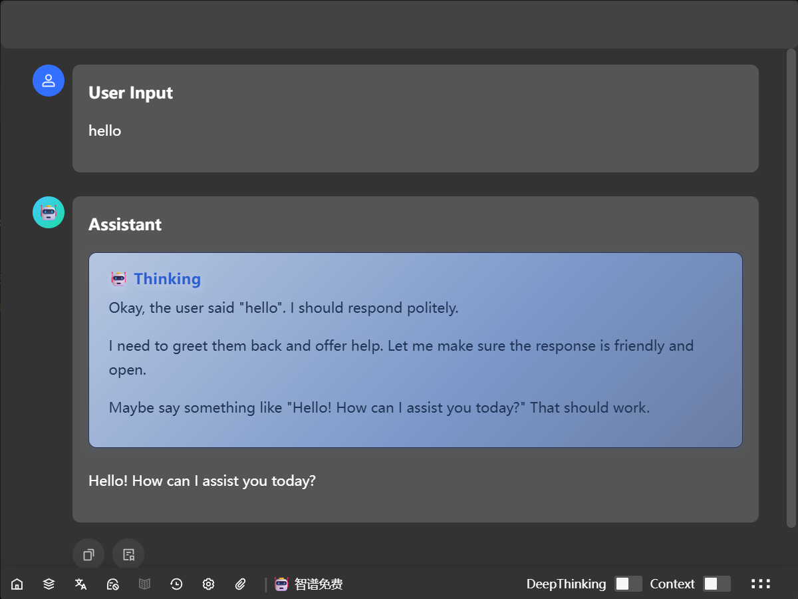

[简体中文](./README_CN.md)

# Pomegranate AI Assistant

A private AI assistant that comes when called and leaves when dismissed, focused on data privacy, strive for simplicity and fun

## 🆓 Freely Experience Various Models! 🤩✨

## 🔒 Privacy First

- **No Data Collection**: No information is collected.
- **Always Local**: All data is stored locally (never uploaded to the cloud).

## 🚀 Basic Features

- **Basic AI Conversation**  
   Simple and efficient AI interaction experience.  
   Mermaid chart and formula rendering support `0.0.21+`
- **Prompt Management**  
   Easily manage and use various prompts to improve efficiency.
- **Attachment Upload**  
   Support for uploading files as attachments to assist conversations and knowledge processing.
- **AI & Everything File Search**  
   Combine AI understanding with the Everything tool for intelligent local file search.
- **Favorite Useful Answers**  
   Save useful answers to your favorites, edit and export them for future reference.
- **Knowledge Card Generation**  
   Automatically generate knowledge cards to help organize and review key information.
- **Quick Launch** `0.0.24+` 
  Supports the quick launch of local apps, files, and folders

## 🧠 Advanced Features

- **Autonomous Memory**  
   When enabled, AI can automatically extract key information from conversations and remember it locally, continuously enhancing its capabilities.
- **RAG (Retrieval-Augmented Generation)**  
   Supports local knowledge base with hybrid retrieval using dense vectors, sparse features, and BM25 to improve knowledge acquisition.

## 📝 Download

- [Download from Github](https://github.com/Magic-zhu/PomAIAssistant/releases)
- [Download from Baidu Netdisk](https://pan.baidu.com/s/1KuCwatlTPAf4uVUFB1xCEQ?pwd=1234)

## 📖 Documentation

## 📌 Shortcuts

| ⌨️ Shortcut           | Description                                    |
| --------------------- | ---------------------------------------------- |
| Ctrl+Space            | Show/Hide Window                               |
| ArrowDown (Input Box) | Show prompt list, `Enter` to select            |
| Ctrl+K                | Clear context and messages                     |
| Alt+F                 | Focus on input box                             |
| Ctrl+F                | Open file search tool                          |
| Ctrl+Q                | Exit file search tool                          |
| F1                    | Switch to main conversation interface          |
| F2                    | Switch to model selection interface            |
| Tab                   | Focus on input box or open quick function menu |

---
