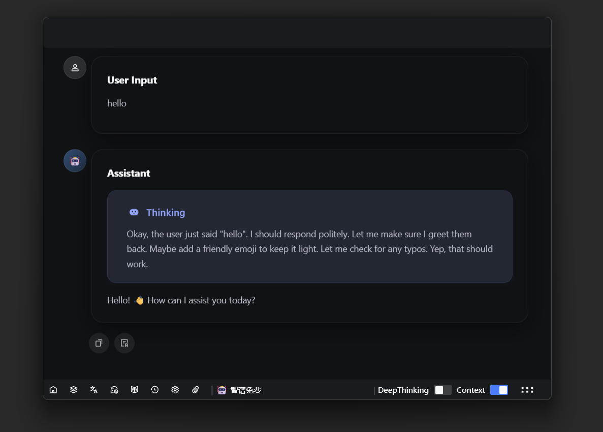

# 小石榴 AI 助手

呼之即来挥之即去的私人 AI 助手，专注于数据隐私，追求极致简洁与趣味

**小石榴 AI 助手**：您的随时待命、隐私优先的 AI 助手

## 🔒 隐私至上

- **不收集数据**：不会收集任何信息。
- **始终本地**：所有数据仅保存在本地（不上传云端）。

## 🚀 功能

- **基本 AI 对话**：简单高效的 AI 交流。
- **提示词管理**：轻松管理您的提示词。
- **附件上传**：支持文件作为附件上传。
- **AI 与 Everything 文件搜索**：结合 AI 和 Everything 进行文件搜索。
- **收藏有用回答**：将有用的回答收藏到历史收藏（编辑与导出功能即将上线）。
- **知识卡片生成**：生成知识卡片（即将上线）。

## 📝 使用方法

[下载地址](https://github.com/Magic-zhu/PomAIAssistant/releases)

1. 下载zip文件。
2. 解压到任意文件夹。
3. 打开 `PomAiAssistant.exe` 文件。
4. 配置模型。
5. 在输入框中输入您的指令。
6. 按下 Enter 键执行命令。
7. 获取您想知道的信息。
8. 按 Ctrl+Space 关闭助手 😊~。

## 📌 快捷键

| ⌨️ 快捷键           | 功能说明                     |
| ------------------- | ---------------------------- |
| Ctrl+Space          | 唤出/隐藏窗口                |
| ArrowDown（输入框） | 唤出提示词列表，`Enter` 选中 |
| Ctrl+K              | 清除上下文和消息             |
| Alt+F               | 聚焦输入框                   |
| Ctrl+F              | 打开文件查找工具             |
| Ctrl+Q              | 退出文件查找工具             |
| F1                  | 切换到主对话界面             |
| F2                  | 切换到模型选择界面           |
